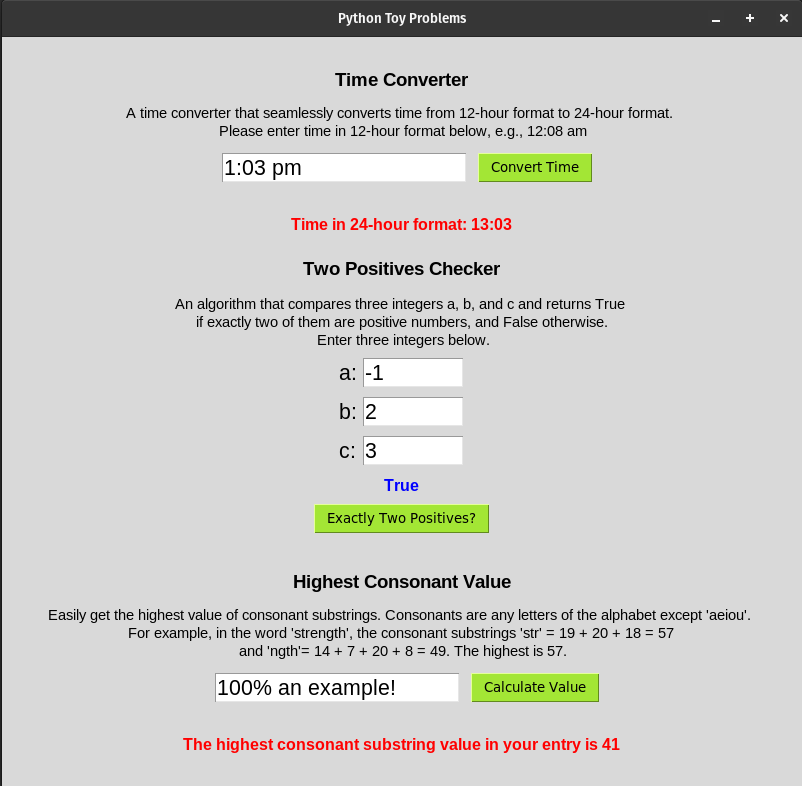

# Python Toy Problems
## Phase 3 Week 1 Code Challenge

[](./LICENSE)


## Introduction

This repo contains three toy problems solved using Python. The problems are described below, including converting 12-hour time to 24-hour time, finding whether exactly two out of three integers in an input of three are positive, and finding the highest value of consonant substrings in a string input.

A Tkinter v.8.6 GUI has been build and the script has been bundled into an executable file for Linux & macOS.



## Prerequisites

Python3 (v3.10.12 or later)

## Project Setup

### 1. Clone the repository

```
git clone https://github.com/ArshavineRoy/python-toy-problems
```

### 2. Navigate to the project's directory

```
cd python-toy-problems
```

### 3. Run the script directly from the terminal

```
./app.py
```

### 4. Alternatively, open the `dist` folder and double-click `app` to run the script

### 5. Code solutions for all toy problems can be found in the `toy-problems` directory

## Deliverables
### 1: Converting 12-hour time to 24-hour time
Converting a 12-hour time like "8:30 am" or "8:30 pm" to 24-hour time (like "0830" or "2030") sounds easy enough, right? Well, let's see if you can do it!

You will have to define a function, which will be given an hour (always in the range of 1 to 12, inclusive), a minute (always in the range of 0 to 59, inclusive), and a period (either "am" or "pm") as input.

Your task is to return a four-digit string that encodes that time in 24-hour time.

```
By convention, noon is 12:00 pm, and midnight is 12:00 am.

On 12-hours clock, there is no 0 hour, and time just after midnight is denoted as, for example, 12:15 am. 

On 24-hour clock, this translates to 0015.
``` 

### 2: Two numbers are positive.
Write a function which takes three integers a, b, and c as arguments, and returns **True** if exactly two of of the three integers are positive numbers (greater than zero), and **False** - otherwise.

Examples:
```py
(2, 4, -3) == True

(-4, 6, 8) == True

(4, -6, 9) == True

(-4, 6, 0) == False

(4, 6, 10) == False

(-14, -3, -4) == False
``` 

### 3: Consonant value
Given a lowercase string that has alphabetic characters only and no spaces, return the highest value of consonant substrings.

*Consonants are any letters of the alphabet except "aeiou".We shall assign the following values: a = 1, b = 2, c = 3, .... z = 26.*

Examples:

```
For the word "zodiacs", solve("zodiacs") = 26

For example, for the word "zodiacs", let's cross out the vowels. We get: "z d cs"

The consonant substrings are: "z", "d" and "cs" and the values are z = 26, d = 4 and cs = 3 + 19 = 22. 

The highest is 26.

For the word "strength", solve("strength") = 57.

The consonant substrings are: "str" and "ngth" with values "str" = 19 + 20 + 18 = 57 
and "ngth" = 14 + 7 + 20 + 8 = 49. The highest is 57.
```

## Author & License

Authored by [Arshavine Waema](https://github.com/ArshavineRoy).

Licensed under the [MIT License](LICENSE) - see the [LICENSE](LICENSE) file for details.

